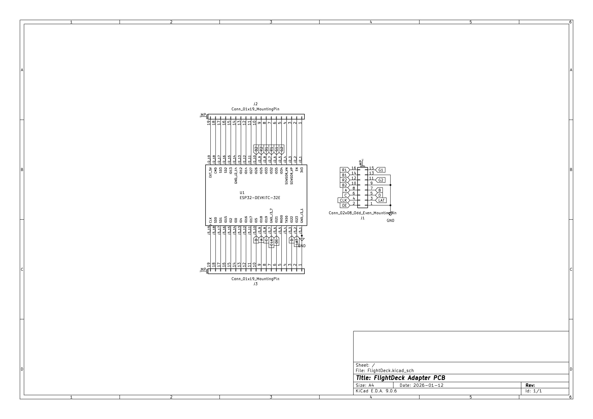
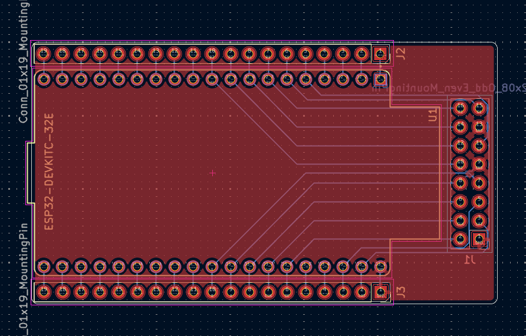
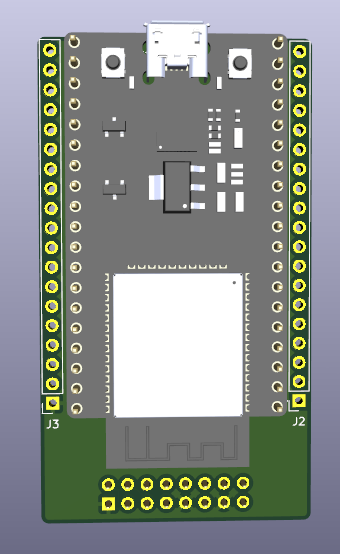
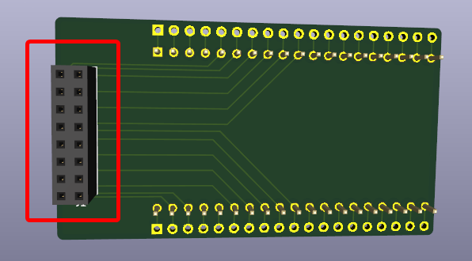
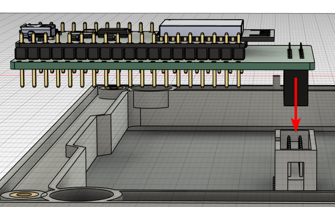
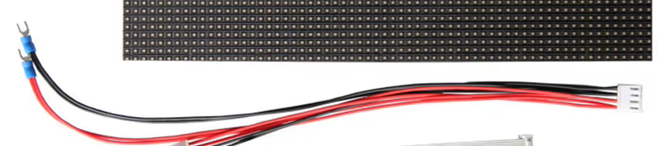
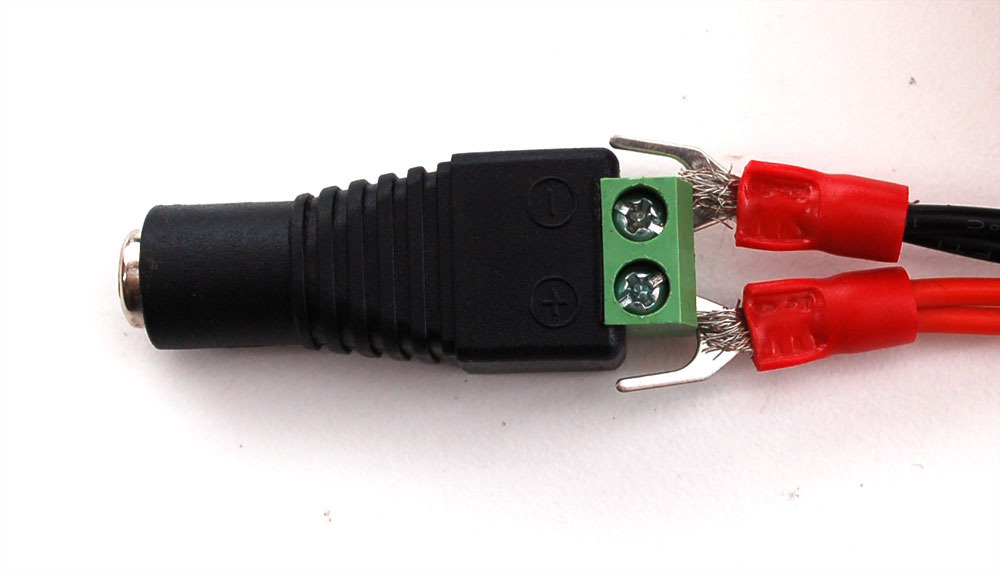
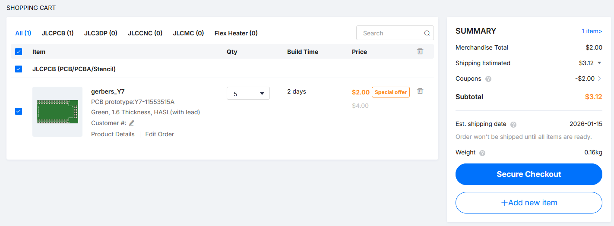

# FlightDeck

Show your overhead flights in a nice and large LED matrix! Perfect addition to any room, especially to those nearby airports.

Additionally, the matrix will be able to display whatever you want in sleep/home states (when there are no flights), all customizable via a webserver hosted on the ESP, including displaying custom APIs!

I've seen a couple projects like this, and thought it would provide some nice experience to make my own, and it fits perfectly for Hack Club's Blueprint YSWS!

I haven't looked at any other similar projects, I want to build my own without copying others.

## Hardware

A custom PCB is required for this project to connect the ESP dev board to the LED matrix.
All the gerber and KiCad files are in the `pcb` folder, and should run you about $5 on JLCPCB.

The rest of the hardware falls around $40 total on Aliexpress. See the [BOM](BOM) below.

- 64x32 RGB LED Matrix, 5mm pitch, 320x160mm ([Aliexpress](https://www.aliexpress.us/item/2251832185365664.html?spm=a2g0o.cart.0.0.2e4d38da3nXc6x&mp=1&pdp_npi=6%40dis%21USD%21USD%2012.49%21USD%2012.49%21%21USD%2012.49%21%21%21%402103126e17682735896398074e7fd6%2157993804537%21ct%21US%216602055344%21%211%210%21&gatewayAdapt=glo2usa#nav-specification))
- ESP32-DevKitC V4 Devboard ([Aliexpress](https://www.aliexpress.us/item/3256808703088919.html?spm=a2g0o.detail.0.0.5140gswugswudo&mp=1&pdp_npi=6%40dis%21USD%21USD%208.58%21USD%208.58%21%21USD%208.58%21%21%21%4021030a4b17682769544637132ef6ef%2112000047093672778%21ct%21US%216602055344%21%211%210%21&gatewayAdapt=glo2usa))
- 2x8 Through-hole Female Pin Socket ([Aliexpress](https://www.aliexpress.us/item/3256803911413457.html?spm=a2g0o.detail.0.0.f165asKbasKbNN&mp=1&pdp_npi=6%40dis%21USD%21USD%204.79%21USD%203.85%21%21USD%203.85%21%21%21%402101eede17682773036007831e7bf5%2112000028025434755%21ct%21US%216602055344%21%211%210%21&gatewayAdapt=glo2usa)) (only available in 10pcs packs) 
- 2.1mm Terminal Block Adapter ([Aliexpress](https://www.aliexpress.us/item/3256806569458868.html?spm=a2g0o.productlist.0.0.1448c50c2Ocu5n&mp=1&pdp_npi=6%40dis%21USD%21USD%204.07%21USD%203.91%21%21USD%203.91%21%21%21%402103126e17682742270461949e7fd6%2112000038197813479%21ct%21US%216602055344%21%211%210%21&gatewayAdapt=glo2usa)) (also only in 10 packs)
- 5V 5A Barrel Jack Power Supply ([Aliexpress](https://www.aliexpress.us/item/3256807146253605.html?spm=a2g0o.cart.0.0.1e5c38daCS0svQ&mp=1&pdp_npi=6%40dis%21USD%21USD%2011.26%21USD%2010.67%21%21USD%2010.67%21%21%21%402101ea8c17682799562916428e3d0e%2112000040414863406%21ct%21US%216602055344%21%211%210%21&gatewayAdapt=glo2usa))

### PCB

The PCB is pretty simple, just a bunch of holes for the ESP and HUB75 connector. 
There are extra holes along the ESP in case of emergency jumper wiring.

### Wiring

1. Solder the dev board into the PCB. The PCB should have silkscreen text where you are putting the board. The USB should be hanging off the edge slightly.

2. Solder the pin connectors on the BACK of the PCB (opposite side of the dev board)

3. Insert the PCB into the back of the LED matrix, making sure that the one you are plugging into is the INPUT (on the left), not the OUTPUT connector.

4. Connect the included power cables to the back of the LED matrix, then plug the U shaped ends into the (female) terminal block adapters, like so

5. Plug in your power supply to the adapter
6. Plug in micro USB to the esp

## Firmware

Programmed in CircuitPython, using the https://airlabs.co/ free live flight API. You may have to send them an email to get access. 

Make sure to rename the `settings.example.toml` file to `settings.toml` and fill in all the values.

TODO: There will be a webserver to customize the panel with, including custom sleep/home screens and custom API connections.

## BOM

**Please note: some of these items are only available in packs of 10 or 5, I could not find a cheaper alternative.**

| Name |Description | Link | Cost | Quantity | Total Price |
| ---- | --- | --- | --- | --- | --- |
| Factory P5 Indoor 320mmx160mm 16 Scan SMD Full Color Module 64x32 Pixels Dot Matrix Panel Video Screen Board | 64x32 LED Matrix | [Aliexpress](https://www.aliexpress.us/item/2251832185365664.html?spm=a2g0o.cart.0.0.64d038dauBZnYy&mp=1&pdp_npi=6%40dis%21USD%21USD%2012.49%21USD%2011.69%21%21USD%2011.69%21%21%21%402103128917674129797053573ecebd%2157993804537%21ct%21US%216602055344%21%211%210%21&gatewayAdapt=glo2usa) | $11.69 | 1 | $11.69 |
| ESP32-DevKitC V4 core board ESP32 development board All Types with ESP32-WROOM-32 32D 32U 32E WIFI+Bluetooth IoT NodeMCU-32 | ESP32-DevKitC V4 Dev Board | [Aliexpress](https://www.aliexpress.us/item/3256808703088919.html?spm=a2g0o.cart.0.0.2c9538dayiBd5T&mp=1&pdp_npi=6%40dis%21USD%21USD%208.58%21USD%208.58%21%21USD%208.58%21%21%21%402103126e17682743226734291e7fd6%2112000047093672778%21ct%21US%216602055344%21%211%210%21&gatewayAdapt=glo2usa) | $7.78 | 1 | $7.78 |
| 10PCS 2.54mm Double Row Female Long Pin 11mm Breakaway PCB Board Pin Header Socket Connector 2x8 pins | 2x8 Through-hole Female Pin Sockets (10pcs) | [Aliexpress](https://www.aliexpress.us/item/3256803911413457.html?spm=a2g0o.cart.0.0.2c9538dayiBd5T&mp=1&pdp_npi=6%40dis%21USD%21USD%204.79%21USD%203.85%21%21USD%203.85%21%21%21%402103126e17682743226734291e7fd6%2112000028025434755%21ct%21US%216602055344%21%211%210%21&gatewayAdapt=glo2usa) | $3.85 | 1 | $3.85 |
| 5pcs DC 12V Female And Male Connectors 5.5x2.1mm Power Plug Adapter Jacks Sockets For Signal Color LED Strip Light CCTV Camera | 2.1mm Terminal Block Adapter (5pcs) | [Aliexpress](https://www.aliexpress.us/item/3256806079081322.html?spm=a2g0o.cart.similar_items.1.4c2938da4WRVyR&utparam-url=scene%3Aimage_search%7Cquery_from%3Acart_normal_item%7Cx_object_id%3A1005006265396074%7C_p_origin_prod%3A&algo_pvid=84213d49-7822-45b7-86d6-2cbb8091ce92&algo_exp_id=84213d49-7822-45b7-86d6-2cbb8091ce92&pdp_ext_f=%7B%22order%22%3A%223742%22%2C%22fromPage%22%3A%22search%22%7D&pdp_npi=6%40dis%21USD%213.89%211.99%21%21%2126.98%2113.82%21%40210319b017683292512364683ef193%2112000036535453252%21sea%21US%216602055344%21X%211%210%21n_tag%3A-29911%3Bd%3A92c261d9%3Bm03_new_user%3A-29895%3BpisId%3A5000000198192865&gatewayAdapt=4itemAdapt) | $1.83 | 1 | $1.83 |
| DC 5V LED Power Supply AC 110V~220V Lighting Transformer 4A Power Adapters For CCTV Camera Router | 5V 4A Power Supply | [Aliexpress](https://www.aliexpress.us/item/3256806800927492.html?spm=a2g0o.cart.similar_items.3.4c2938dam4DysV&utparam-url=scene%3Aimage_search%7Cquery_from%3Acart_normal_item%7Cx_object_id%3A1005006987242244%7C_p_origin_prod%3A&algo_pvid=6da0179e-90c3-45d4-a35c-01e6f266bc89&algo_exp_id=6da0179e-90c3-45d4-a35c-01e6f266bc89&pdp_ext_f=%7B%22order%22%3A%22617%22%2C%22fromPage%22%3A%22search%22%7D&pdp_npi=6%40dis%21USD%213.38%212.48%21%21%2123.41%2117.16%21%40210319b017683291228331371ef193%2112000038965797747%21sea%21US%216602055344%21X%211%210%21n_tag%3A-29911%3Bd%3A92c261d9%3Bm03_new_user%3A-29895%3BpisId%3A5000000198192865&gatewayAdapt=4itemAdapt) | $5.18 | 1 | $5.18 |
| JLCPCB Order (5 PCBs) | PCB |  | $3.12 | 1 | $3.12 |
| Total |  |  |  |  | $37.13 |

