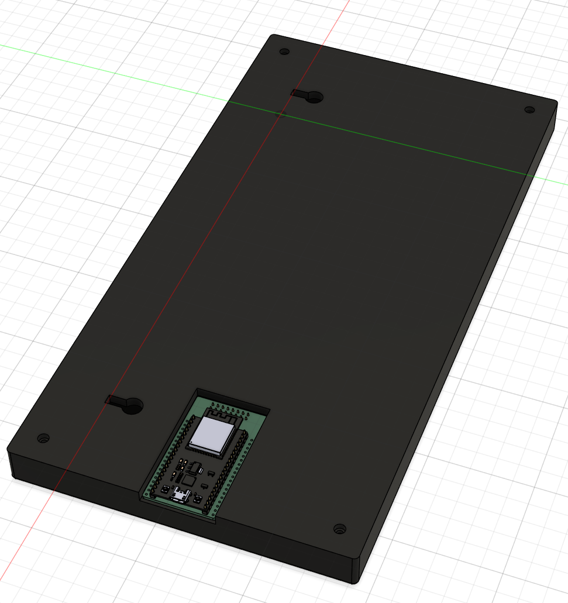
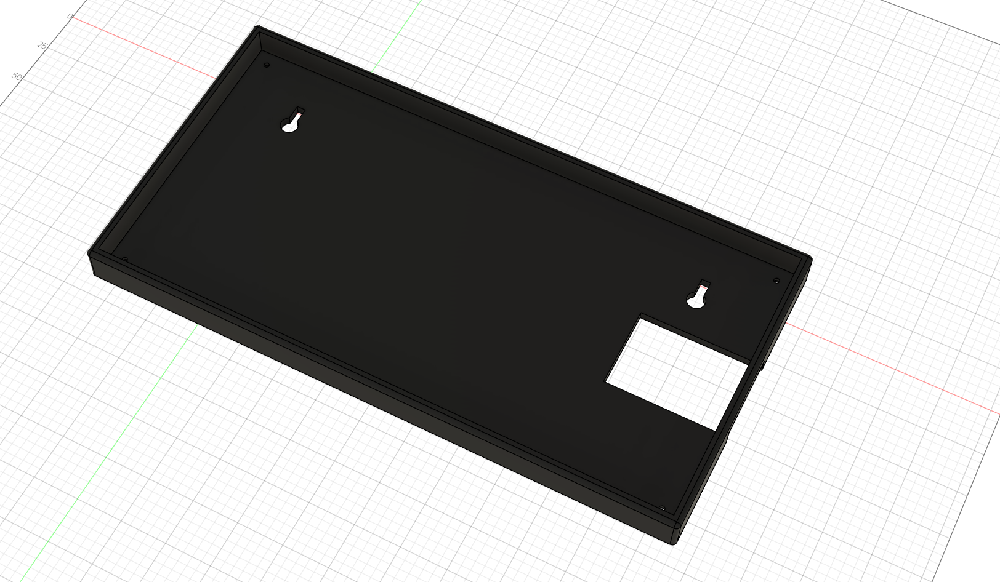
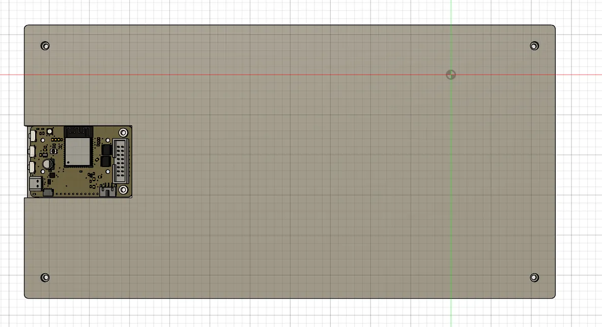

# FlightDeck

Show your overhead flights in a nice and large LED matrix! Perfect addition to any room, especially to those nearby airports.

I've seen a couple projects like this, and thought it would provide some nice experience to make my own, and it fits perfectly for Hack Club's Blueprint YSWS!

I haven't looked at any other similar projects, I want to build my own without copying others.

## Hardware

The hardware falls around $40 on Aliexpress, if you order from Adafruit it will be more, the parts from Aliexpress should be identical.

- Adafruit 64x32 RGB LED Matrix, 5mm pitch, 320x160mm ([Aliexpress](https://www.aliexpress.us/item/2251832185365664.html?spm=a2g0o.cart.0.0.2df338da3gqd4x&mp=1&pdp_npi=6%40dis%21USD%21USD%2012.49%21USD%2011.69%21%21USD%2011.69%21%21%21%402101d97817674142255001359e91db%2157993804537%21ct%21US%216602055344%21%211%210%21&gatewayAdapt=glo2usa))
- Adafruit Matrix Portal ESP-S3 ([Aliexpress](https://www.aliexpress.us/item/3256810420069690.html?spm=a2g0o.cart.0.0.2df338da3gqd4x&mp=1&pdp_npi=6%40dis%21USD%21USD%2034.55%21USD%2022.80%21%21USD%2022.80%21%21%21%402101d97817674142255001359e91db%2112000052957076504%21ct%21US%216602055344%21%211%210%21&gatewayAdapt=glo2usa))

Use [this website](https://learn.adafruit.com/adafruit-matrixportal-s3/overview) for more information on setting up the Matrix Portal.

The power and data connections are pretty simple, use the power wires from the LED Matrix to connect the microcontroller and just plug the microcontroller directly into the LED matrix, no need for the ribbon cable. [This guide](https://learn.adafruit.com/rgb-led-matrices-matrix-panels-with-circuitpython/) explains it in more detail.

### Wiring Diagram

(Pretend the microcontroller is an S3 not M4, it has the same wiring)

## Firmware

Programmed in CircuitPython, using the https://airlabs.co/ free live flight API. You may have to send them an email to get access. 

Make sure to rename the `settings.example.toml` file to `settings.toml` and fill in all the values.

## BOM

| Name |Description | Link | Cost | Amount | Total |
| ---- | --- | --- | --- | --- | --- |
Factory P5 Indoor 320mmx160mm 16 Scan SMD Full Color Module 64x32 Pixels Dot Matrix Panel Video Screen Board | 64x32 LED Matrix | https://www.aliexpress.us/item/2251832185365664.html?spm=a2g0o.cart.0.0.64d038dauBZnYy&mp=1&pdp_npi=6%40dis%21USD%21USD%2012.49%21USD%2011.69%21%21USD%2011.69%21%21%21%402103128917674129797053573ecebd%2157993804537%21ct%21US%216602055344%21%211%210%21&gatewayAdapt=glo2usa | $11.69 | 1 | $11.69 |
HUB75 RGB LED Matrix Opto Evaluation Extension Board S3 Circuitpython Powered Internet Display | Matrix Portal ESP-S3 | https://www.aliexpress.us/item/3256810420069690.html?spm=a2g0o.cart.0.0.64d038dauBZnYy&mp=1&pdp_npi=6%40dis%21USD%21USD%2034.55%21USD%2022.80%21%21USD%2022.80%21%21%21%402103128917674129797053573ecebd%2112000052957076504%21ct%21US%216602055344%21%211%210%21&gatewayAdapt=glo2usa | $26.00 | 1 | $26.00 |
